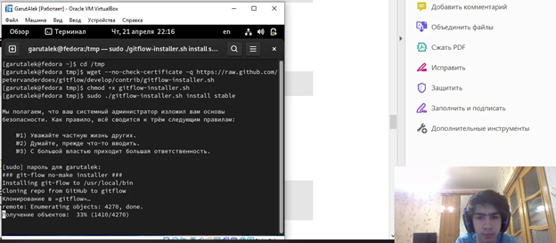
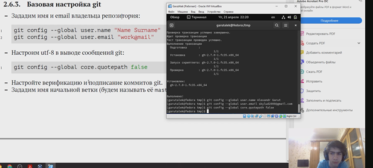
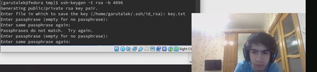
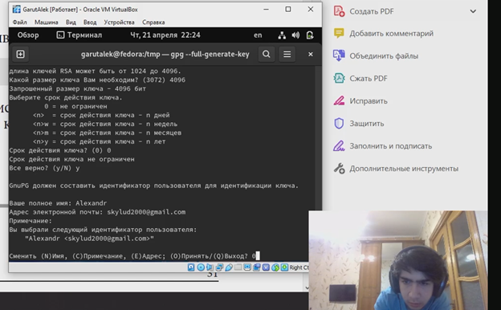
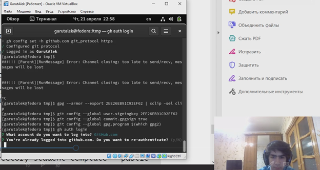
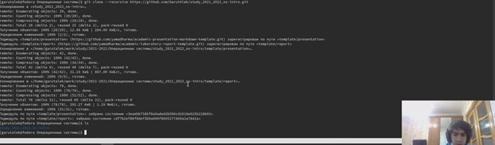
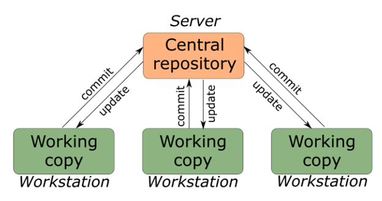
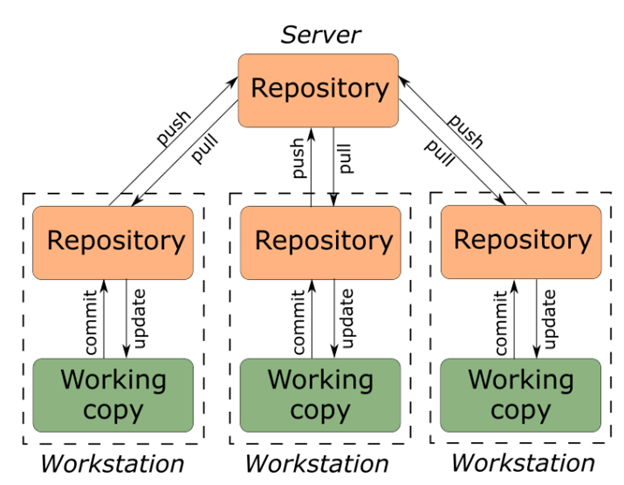

---
## Front matter
title: "Лабораторная работа 2"
subtitle: "Управление версиями"
author: "Гарут Александр Игоревич"

## Generic otions
lang: ru-RU
toc-title: "Содержание"

## Bibliography
bibliography: bib/cite.bib
csl: pandoc/csl/gost-r-7-0-5-2008-numeric.csl

## Pdf output format
toc: true # Table of contents
toc-depth: 2
fontsize: 12pt
linestretch: 1.5
papersize: a4
documentclass: scrreprt
## I18n polyglossia
polyglossia-lang:
  name: russian
  options:
	- spelling=modern
	- babelshorthands=true
polyglossia-otherlangs:
  name: english
## I18n babel
babel-lang: russian
babel-otherlangs: english
## Fonts
mainfont: PT Serif
romanfont: PT Serif
sansfont: PT Sans
monofont: PT Mono
mainfontoptions: Ligatures=TeX
romanfontoptions: Ligatures=TeX
sansfontoptions: Ligatures=TeX,Scale=MatchLowercase
monofontoptions: Scale=MatchLowercase,Scale=0.9
## Biblatex
biblatex: true
biblio-style: "gost-numeric"
biblatexoptions:
  - parentracker=true
  - backend=biber
  - hyperref=auto
  - language=auto
  - autolang=other*
  - citestyle=gost-numeric
## Pandoc-crossref LaTeX customization
figureTitle: "Рис."
tableTitle: "Таблица"
listingTitle: "Листинг"
lolTitle: "Листинги"
## Misc options
indent: true
header-includes:
  - \usepackage{indentfirst}
  - \usepackage{float} # keep figures where there are in the text
  - \floatplacement{figure}{H} # keep figures where there are in the text
---

# Цель работы

Изучить идеологию и применение средств контроля версий. Освоить умения по работе с git.

# Ход работы

1.	Создание базовой конфигурации для работы с git

{ width=100% }
*Изображение 1.1: установка компонентов*

{ width=100% }
*Изображение 1.2: настройка git*

2.	Создание ключей

{ width=100% }
*Изображение 2.1: Создание SSH ключа*

{ width=100% }
*Изображение 2.2: Создание PGP ключа*

3.	Настройка подписи git

{ width=100% }
*Изображение 3: настройка подписи git*

4.	Создание локального каталога для выполнения заданий по предмету

{ width=100% }
*Изображение 4: создание каталога*

# Вывод

Была изучена идеология и применены средства контроля версий, а также освоены умения по работе с git.

# Контрольные вопросы

1.	Система управления версиями (также используется определение «система контроля версий[1]», от англ. Version Control System, VCS или Revision Control System) — программное обеспечение для облегчения работы с изменяющейся информацией. Система управления версиями позволяет хранить несколько версий одного и того же документа, при необходимости возвращаться к более ранним версиям, определять, кто и когда сделал то или иное изменение, и многое другое.
2.	Хранилище – то где хранится документ
Commit – изменение документа
История – история изменения документа
Рабочая копия – текущая версия документа
3.	Централизованная:

{ width=100% }

Децентрализованная:

{ width=100% }

4.	Изначально разработчик работает с веткой master. При реализации отдельных частей проекта может создать ветки для них. При завершении изменений разработчик коммитит и пушит изменения на сервер. Если разработка на сторонней ветке завершена, то её можно смерджить (merge), например с основной веткой master. 
