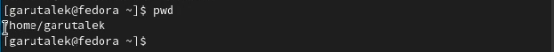
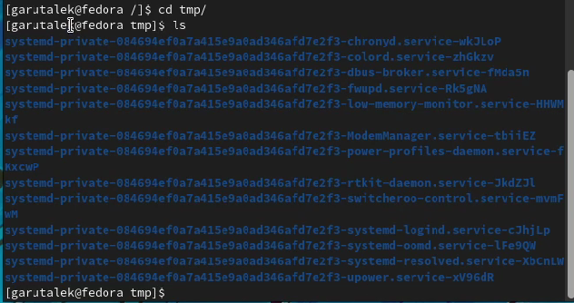
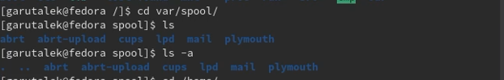
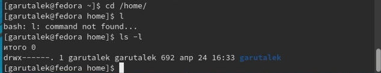
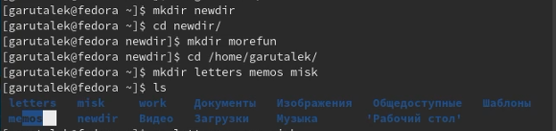
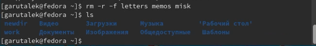
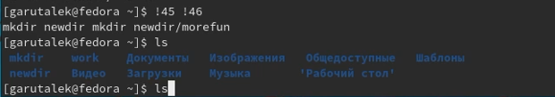

---
## Front matter
title: "Лабораторная работа 4"
subtitle: "Основы интерфейса взаимодействия пользователя с системой Unix на уровне командной строки"
author: "Гарут Алекснадр Игоревич"

## Generic otions
lang: ru-RU
toc-title: "Содержание"

## Bibliography
bibliography: bib/cite.bib
csl: pandoc/csl/gost-r-7-0-5-2008-numeric.csl

## Pdf output format
toc: true # Table of contents
toc-depth: 2
fontsize: 12pt
linestretch: 1.5
papersize: a4
documentclass: scrreprt
## I18n polyglossia
polyglossia-lang:
  name: russian
  options:
	- spelling=modern
	- babelshorthands=true
polyglossia-otherlangs:
  name: english
## I18n babel
babel-lang: russian
babel-otherlangs: english
## Fonts
mainfont: PT Serif
romanfont: PT Serif
sansfont: PT Sans
monofont: PT Mono
mainfontoptions: Ligatures=TeX
romanfontoptions: Ligatures=TeX
sansfontoptions: Ligatures=TeX,Scale=MatchLowercase
monofontoptions: Scale=MatchLowercase,Scale=0.9
## Biblatex
biblatex: true
biblio-style: "gost-numeric"
biblatexoptions:
  - parentracker=true
  - backend=biber
  - hyperref=auto
  - language=auto
  - autolang=other*
  - citestyle=gost-numeric
## Pandoc-crossref LaTeX customization
figureTitle: "Рис."
tableTitle: "Таблица"
listingTitle: "Листинг"
lofTitle: "Список иллюстраций"
lotTitle: "Список таблиц"
lolTitle: "Листинги"
## Misc options
indent: true
header-includes:
  - \usepackage{indentfirst}
  - \usepackage{float} # keep figures where there are in the text
  - \floatplacement{figure}{H} # keep figures where there are in the text
---

# Цель работы

Приобретение практических навыков взаимодействия пользователя с системой посредством командной строки.

# Ход работы

1. Определяем полное имя домашнего каталога

 { width=100% }
*Изображение1: Команда pwd*

2. Выполнение пункта 2 Лабораторной работы

 { width=100% }
*Изображение2.1: Переход в каталог /tmp и вывод его содержимого*

 { width=100% }
*Изображение2.2: Содержится ли в var/spoon cron*

 { width=100% }
*Изображение2.3: Кто является владельцем домашнего каталога*

3. Выполнение пункта 3 Лабораторной работы

 { width=100% }
*Изображение3.1: Создание каталогов*

 { width=100% }
*Изображение3.2: Удаление каталогов*

4. Выполнение пункта 7 Лабораторной работы

 { width=100% }
*Изображение4: Выполнение нескольких команд из буфера обмена*

# Вывод

Были приобретены практические навыки взаимодействия пользователя с системой посредством командной строки.

# Контрольные вопросы

1. Командная строка (консоль или Терминал) – это специальная программа, которая позволяет управлять компьютером путем ввода текстовых команд с клавиатуры.

2. pwd dir

3. ls

4. ls -a

5. rm dir

   rm -f -r dir

6. history

7. !CommandNumber from history

8. cd home; ls

9. Экранирование символов — замена в тексте управляющих символов на соответствующие текстовые подстановки. Один из видов управляющих последовательностей.
