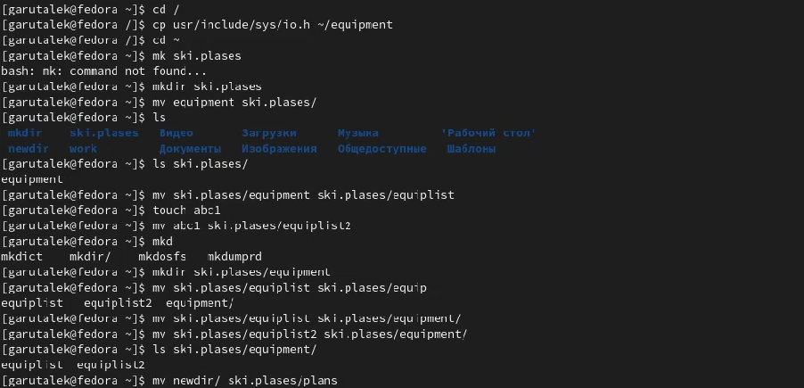
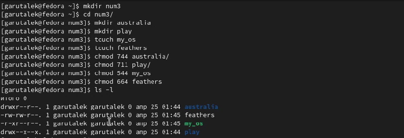
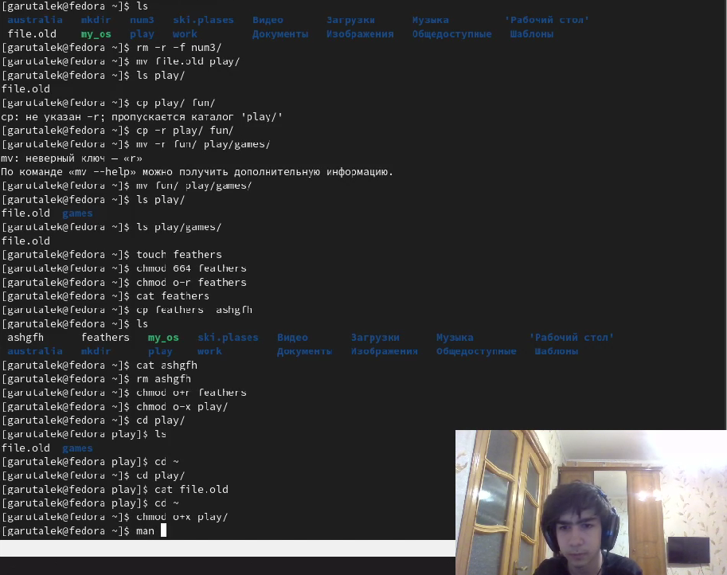

---
## Front matter
title: "Лабораторная работа 5"
subtitle: "Анализ файловой системы Linux. Команды для работы с файлами и каталогами"
author: "Гарут Александр Игоревич"

## Generic otions
lang: ru-RU
toc-title: "Содержание"

## Bibliography
bibliography: bib/cite.bib
csl: pandoc/csl/gost-r-7-0-5-2008-numeric.csl

## Pdf output format
toc: true # Table of contents
toc-depth: 2
fontsize: 12pt
linestretch: 1.5
papersize: a4
documentclass: scrreprt
## I18n polyglossia
polyglossia-lang:
  name: russian
  options:
	- spelling=modern
	- babelshorthands=true
polyglossia-otherlangs:
  name: english
## I18n babel
babel-lang: russian
babel-otherlangs: english
## Fonts
mainfont: PT Serif
romanfont: PT Serif
sansfont: PT Sans
monofont: PT Mono
mainfontoptions: Ligatures=TeX
romanfontoptions: Ligatures=TeX
sansfontoptions: Ligatures=TeX,Scale=MatchLowercase
monofontoptions: Scale=MatchLowercase,Scale=0.9
## Biblatex
biblatex: true
biblio-style: "gost-numeric"
biblatexoptions:
  - parentracker=true
  - backend=biber
  - hyperref=auto
  - language=auto
  - autolang=other*
  - citestyle=gost-numeric
## Pandoc-crossref LaTeX customization
figureTitle: "Рис."
tableTitle: "Таблица"
listingTitle: "Листинг"
lofTitle: "Список иллюстраций"
lotTitle: "Список таблиц"
lolTitle: "Листинги"
## Misc options
indent: true
header-includes:
  - \usepackage{indentfirst}
  - \usepackage{float} # keep figures where there are in the text
  - \floatplacement{figure}{H} # keep figures where there are in the text
---

# Цель работы

Ознакомление с файловой системой Linux, её структурой, именами и содержанием
каталогов. Приобретение практических навыков по применению команд для работы
с файлами и каталогами, по управлению процессами (и работами), по проверке использования диска и обслуживанию файловой системы.

# Ход работы

  Пункт номер 1 лабораторной работы оказался крайне запутанным, в связи с чем я не смог понять что от меня требуется и перешёл к пункту 2 лабораторной работы

1. Выполнение пункта 2 лабораторной работы

 { width=100% }
*Изображение1: Выполнение действий, описанных в пункте 2 лабораторной работы*

2. Выполнение пункта 3 лабораторной работы

 { width=100% }
*Изображение2: Выделение прав доступа для файлов*

3. Выполнение пункта 4 лабораторной работы

 { width=100% }
*Изображение3: Выполнение действий, описанных в пункте 2 лабораторной работы*

# Вывод

Были ознакомлены с файловой системой Linux, её структурой, именами и содержанием каталогов. Были приобретены практические навыки по применению команд для работы с файлами и каталогами, по управлению процессами (и работами), по проверке использования диска и обслуживанию файловой системы.

# Контрольные вопросы

1. NTFS (аббревиатура от англ. new technology file system — «файловая система новой технологии») — стандартная файловая система для семейства операционных систем Windows NT фирмы Microsoft.
NTFS поддерживает хранение метаданных. С целью улучшения производительности, надёжности и эффективности использования дискового пространства для хранения информации о файлах в NTFS используются специализированные структуры данных. Информация о файлах хранится в главной файловой таблице — Master File Table (MFT). NTFS поддерживает разграничение доступа к данным для различных пользователей и групп пользователей (списки контроля доступа — англ. access control lists, ACL), а также позволяет назначать дисковые квоты (ограничения на максимальный объём дискового пространства, занимаемый файлами тех или иных пользователей). Для повышения надёжности файловой системы в NTFS используется система журналирования USN. Для NTFS размер кластера по умолчанию составляет от 512 байт до 2 МБ в зависимости от размера тома и версии ОС.

2. 
/ — root каталог. Содержит в себе всю иерархию системы;

/bin — здесь находятся двоичные исполняемые файлы. Основные общие команды, хранящиеся отдельно от других программ в системе (прим.: pwd, ls, cat, ps);

/boot — тут расположены файлы, используемые для загрузки системы (образ initrd, ядро vmlinuz);

/dev — в данной директории располагаются файлы устройств (драйверов). С помощью этих файлов можно взаимодействовать с устройствами. К примеру, если это жесткий диск, можно подключить его к файловой системе. В файл принтера же можно написать напрямую и отправить задание на печать;

/etc — в этой директории находятся файлы конфигураций программ. Эти файлы позволяют настраивать системы, сервисы, скрипты системных демонов;

/home — каталог, аналогичный каталогу Users в Windows. Содержит домашние каталоги учетных записей пользователей (кроме root). При создании нового пользователя здесь создается одноименный каталог с аналогичным именем и хранит личные файлы этого пользователя;

/lib — содержит системные библиотеки, с которыми работают программы и модули ядра;

/lost+found — содержит файлы, восстановленные после сбоя работы системы. Система проведет проверку после сбоя и найденные файлы можно будет посмотреть в данном каталоге;

/media — точка монтирования внешних носителей. Например, когда вы вставляете диск в дисковод, он будет автоматически смонтирован в директорию /media/cdrom;

/mnt — точка временного монтирования. Файловые системы подключаемых устройств обычно монтируются в этот каталог для временного использования;

/opt — тут расположены дополнительные (необязательные) приложения. Такие программы обычно не подчиняются принятой иерархии и хранят свои файлы в одном подкаталоге (бинарные, библиотеки, конфигурации);

/proc — содержит файлы, хранящие информацию о запущенных процессах и о состоянии ядра ОС;

/root — директория, которая содержит файлы и личные настройки суперпользователя;

/run — содержит файлы состояния приложений. Например, PID-файлы или UNIX-сокеты;

/sbin — аналогично /bin содержит бинарные файлы. Утилиты нужны для настройки и администрирования системы суперпользователем;

/srv — содержит файлы сервисов, предоставляемых сервером (прим. FTP или Apache HTTP);

/sys — содержит данные непосредственно о системе. Тут можно узнать информацию о ядре, драйверах и устройствах;

/tmp — содержит временные файлы. Данные файлы доступны всем пользователям на чтение и запись. Стоит отметить, что данный каталог очищается при перезагрузке;

/usr — содержит пользовательские приложения и утилиты второго уровня, используемые пользователями, а не системой. Содержимое доступно только для чтения (кроме root). Каталог имеет вторичную иерархию и похож на корневой;

/var — содержит переменные файлы. Имеет подкаталоги, отвечающие за отдельные переменные. Например, логи будут храниться в /var/log, кэш в /var/cache, очереди заданий в /var/spool/ и так далее.

3. Монтирование тома

4. Отсутствие синхронизации между образом файловой системы в памяти и ее данными на диске в случае аварийного останова может привести к появлению следующих ошибок:

Один блок адресуется несколькими mode (принадлежит нескольким файлам).

Блок помечен как свободный, но в то же время занят (на него ссылается onode).

Блок помечен как занятый, но в то же время свободен (ни один inode на него не ссылается).

Неправильное число ссылок в inode (недостаток или избыток ссылающихся записей в каталогах).

Несовпадение между размером файла и суммарным размером адресуемых inode блоков.

Недопустимые адресуемые блоки (например, расположенные за пределами файловой системы).

"Потерянные" файлы (правильные inode, на которые не ссылаются записи каталогов).

Недопустимые или неразмещенные номера inode в записях каталогов.

5. mkfs - позволяет создать файловую систему Linux.

6. Cat - выводит содержимое файла на стандартное устройство вывода

   less - постраничный просмотр файлов

7. cp - копирует файлы

8. mv - перемещение файлов/директорий в другие директории или переименование файлов/директорий

9. Права доступа к файлу или каталогу можно изменить, воспользовавшись командой chmod. Сделать это может владелец файла (или каталога) или пользователь с правами администратора.