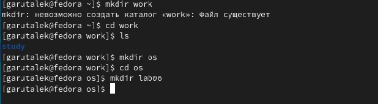

---
## Front matter
title: "Лабораторная работа 8"
subtitle: "Текстовой редактор vi"
author: "Гарут Александр Игоревич"

## Generic otions
lang: ru-RU
toc-title: "Содержание"

## Bibliography
bibliography: bib/cite.bib
csl: pandoc/csl/gost-r-7-0-5-2008-numeric.csl

## Pdf output format
toc: true # Table of contents
toc-depth: 2
fontsize: 12pt
linestretch: 1.5
papersize: a4
documentclass: scrreprt
## I18n polyglossia
polyglossia-lang:
  name: russian
  options:
	- spelling=modern
	- babelshorthands=true
polyglossia-otherlangs:
  name: english
## I18n babel
babel-lang: russian
babel-otherlangs: english
## Fonts
mainfont: PT Serif
romanfont: PT Serif
sansfont: PT Sans
monofont: PT Mono
mainfontoptions: Ligatures=TeX
romanfontoptions: Ligatures=TeX
sansfontoptions: Ligatures=TeX,Scale=MatchLowercase
monofontoptions: Scale=MatchLowercase,Scale=0.9
## Biblatex
biblatex: true
biblio-style: "gost-numeric"
biblatexoptions:
  - parentracker=true
  - backend=biber
  - hyperref=auto
  - language=auto
  - autolang=other*
  - citestyle=gost-numeric
## Pandoc-crossref LaTeX customization
figureTitle: "Рис."
tableTitle: "Таблица"
listingTitle: "Листинг"
lofTitle: "Список иллюстраций"
lotTitle: "Список таблиц"
lolTitle: "Листинги"
## Misc options
indent: true
header-includes:
  - \usepackage{indentfirst}
  - \usepackage{float} # keep figures where there are in the text
  - \floatplacement{figure}{H} # keep figures where there are in the text
---

# Цель работы

Познакомиться с операционной системой Linux. Получить практические навыки работы с редактором vi, установленным по умолчанию практически во всех дистрибутивах.

# Ход работы

1. Создаём каталог work/os/lab06

{ width=100% }
*Изображение1: Создание каталога*

2. Написание текста в hello.sh

Вызовем vi для hello.sh и запишем туда текст из методички

{ width=100% }
*Изображение2: Написанный текст*

Далее нажём esc, : и введём wq для сохранения изменений и выхода из редактора

3. Внесение изменений в файл hello.sh

Запустим редактор vi на редактирование файла и внесём требуемые изменения

{ width=100% }
*Изображение3: Изменённый текст*

# Вывод

Познакомились с операционной системой Linux. Получили практические навыки работы с редактором vi, установленным по умолчанию практически во всех дистрибутивах.

# Контрольные вопросы

1. В редакторе vi есть два основных режима: командный режим и режим вставки. По умолчанию работа начинается в командном режиме.

2. в командном режиме набрать q или q! и нажать enter

3. 
- 0 (ноль) — переход в начало строки;

- $ — переход в конец строки;

- G — переход в конец файла;

- n G — переход на строку с номером n.

5. 
- G - переход в конец файла
- 1 G - переход в начало файла

6. 
– : n,m d — удалить строки с n по m;

– : i,j m k — переместить строки с i по j, начиная со строки k;

– : i,j t k — копировать строки с i по j в строку k;

– : i,j w имя-файла — записать строки с i по j в файл с именем имя-файла.

– : w — записать изменённый текст в файл, не выходя из vi;

– : w имя-файла — записать изменённый текст в новый файл с именем имя-файла;

– : w ! имя-файла — записать изменённый текст в файл с именем имя-файла;

– : w q — записать изменения в файл и выйти из vi;

– : q — выйти из редактора vi;

– : q ! — выйти из редактора без записи;

– : e ! — вернуться в командный режим, отменив все изменения, произведённые
со времени последней записи.

7. c$ $

8. 

- esc -> u -> enter

12. В командном режиме нельзя редактировать текст