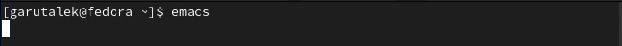
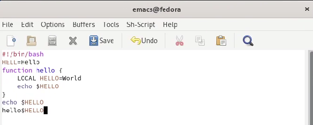
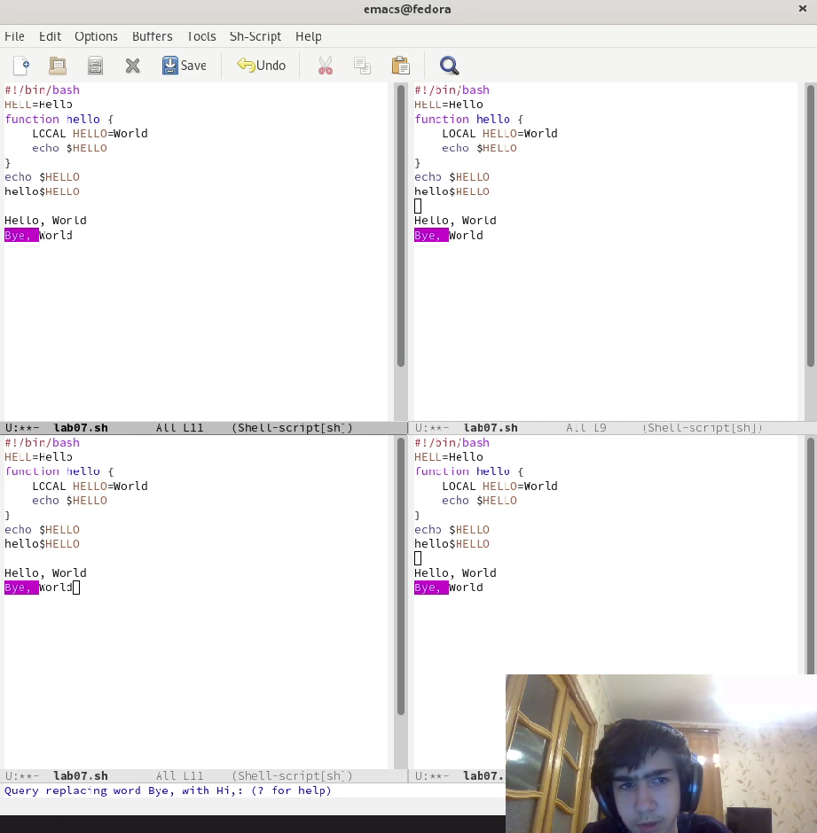

---
## Front matter
title: "Лабораторная работа 9"
subtitle: "Текстовой редактор emacs"
author: "Гарут Александр Игоревич"

## Generic otions
lang: ru-RU
toc-title: "Содержание"

## Bibliography
bibliography: bib/cite.bib
csl: pandoc/csl/gost-r-7-0-5-2008-numeric.csl

## Pdf output format
toc: true # Table of contents
toc-depth: 2
fontsize: 12pt
linestretch: 1.5
papersize: a4
documentclass: scrreprt
## I18n polyglossia
polyglossia-lang:
  name: russian
  options:
	- spelling=modern
	- babelshorthands=true
polyglossia-otherlangs:
  name: english
## I18n babel
babel-lang: russian
babel-otherlangs: english
## Fonts
mainfont: PT Serif
romanfont: PT Serif
sansfont: PT Sans
monofont: PT Mono
mainfontoptions: Ligatures=TeX
romanfontoptions: Ligatures=TeX
sansfontoptions: Ligatures=TeX,Scale=MatchLowercase
monofontoptions: Scale=MatchLowercase,Scale=0.9
## Biblatex
biblatex: true
biblio-style: "gost-numeric"
biblatexoptions:
  - parentracker=true
  - backend=biber
  - hyperref=auto
  - language=auto
  - autolang=other*
  - citestyle=gost-numeric
## Pandoc-crossref LaTeX customization
figureTitle: "Рис."
tableTitle: "Таблица"
listingTitle: "Листинг"
lofTitle: "Список иллюстраций"
lotTitle: "Список таблиц"
lolTitle: "Листинги"
## Misc options
indent: true
header-includes:
  - \usepackage{indentfirst}
  - \usepackage{float} # keep figures where there are in the text
  - \floatplacement{figure}{H} # keep figures where there are in the text
---

# Цель работы

Познакомиться с операционной системой Linux. Получить практические навыки работы с редактором Emacs.

# Ход работы

1. Запустим редактор emacs

{ width=100% }
*Изображение1: Запуск редактора*

2. Написание текста в lab07.sh

Создадим файл lab07.sh, напишем туда текст из методички и попробуем различные команды, предложенные нам в методичке.

{ width=100% }
*Изображение2: Написанный текст*

3. Использование замены текста в редакторе

Разобьём экран на 4 одинаковых области, напишем какой то текст и воспользуемся функцией замены.

{ width=100% }
*Изображение3: Функция замены*

# Вывод

Познакомились с операционной системой Linux. Получили практические навыки работы с редактором emacs.

# Контрольные вопросы

1. Редактор обладает возможностью редактировать текст, а также некоторыми удобными функциями, к примеру поиск текста.

2. Большое количество команд, некоторые из которых непонятно как использовать горячими клавишами.

3. Окно - отображённый буфер. Буфер - какой то текст.

4. В одном окне отображается один буфер, соответственно 10 буферов в одном окне открыть нельзя.

5. GNU Emacs, Messages, scratch.

6. ctrl + c + |

7. c-x 2

8. Настройки emacs хранятся в файле .emacs

9. Удаление предыдущего символа

10. Мне удобнее было использовать emacs, поскольку в нём больше функций и удобнее интерфейс.