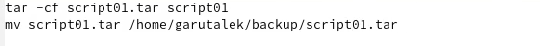
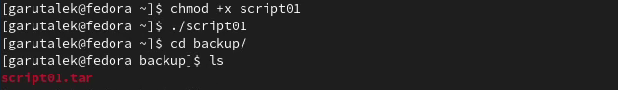
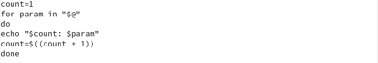
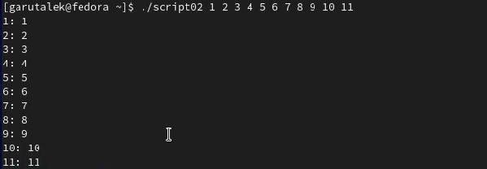
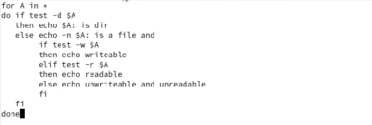
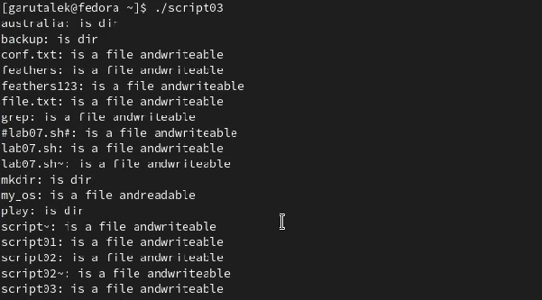
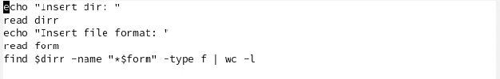
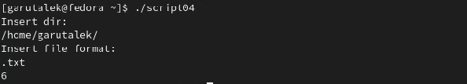

---
## Front matter
title: "Лабораторная работа 10"
subtitle: "Программирование в командном процессоре ОС UNIX. Командные файлы"
author: "Гарут Александр Игоревич"

## Generic otions
lang: ru-RU
toc-title: "Содержание"

## Bibliography
bibliography: bib/cite.bib
csl: pandoc/csl/gost-r-7-0-5-2008-numeric.csl

## Pdf output format
toc: true # Table of contents
toc-depth: 2
fontsize: 12pt
linestretch: 1.5
papersize: a4
documentclass: scrreprt
## I18n polyglossia
polyglossia-lang:
  name: russian
  options:
	- spelling=modern
	- babelshorthands=true
polyglossia-otherlangs:
  name: english
## I18n babel
babel-lang: russian
babel-otherlangs: english
## Fonts
mainfont: PT Serif
romanfont: PT Serif
sansfont: PT Sans
monofont: PT Mono
mainfontoptions: Ligatures=TeX
romanfontoptions: Ligatures=TeX
sansfontoptions: Ligatures=TeX,Scale=MatchLowercase
monofontoptions: Scale=MatchLowercase,Scale=0.9
## Biblatex
biblatex: true
biblio-style: "gost-numeric"
biblatexoptions:
  - parentracker=true
  - backend=biber
  - hyperref=auto
  - language=auto
  - autolang=other*
  - citestyle=gost-numeric
## Pandoc-crossref LaTeX customization
figureTitle: "Рис."
tableTitle: "Таблица"
listingTitle: "Листинг"
lofTitle: "Список иллюстраций"
lotTitle: "Список таблиц"
lolTitle: "Листинги"
## Misc options
indent: true
header-includes:
  - \usepackage{indentfirst}
  - \usepackage{float} # keep figures where there are in the text
  - \floatplacement{figure}{H} # keep figures where there are in the text
---

# Цель работы

Изучить основы программирования в оболочке ОС UNIX/Linux. Научиться писать небольшие командные файлы.

# Ход работы

1. Напишем скрипт, который при запуске делает резервную копию себя, в backup в домашнем каталоге, архивируя себя.

{ width=100% }
*Изображение1.1: Код скрипта*

Удостовермися что всё работает

{ width=100% }
*Изображение1.2: Запуск срипта*

2. Напишем скрипт, принимающий произвольное число аргуметнов, выводящий их же.

{ width=100% }
*Изображение2.1: Код скрипта*

Удостовермися что всё работает

{ width=100% }
*Изображение2.2: Запуск срипта*

3. Напишем скрипт, аналог ls, который выводит файлы из директории и их права доступа.

{ width=100% }
*Изображение3.1: Код скрипта*

Удостовермися что всё работает

{ width=100% }
*Изображение3.2: Запуск срипта*

4. Напишем скрипт, который выводит количество файлов заданного разрешения в заданной диретории.

{ width=100% }
*Изображение4.1: Код скрипта*

Удостовермися что всё работает

{ width=100% }
*Изображение4.2: Запуск срипта*

# Вывод

Изучили основы программирования в оболочке ОС UNIX/Linux. Научились писать небольшие командные файлы.

# Контрольные вопросы

1. Командная оболочка Unix (англ. Unix shell, часто просто «шелл» или «sh») — командный интерпретатор, используемый в операционных системах семейства Unix, в котором пользователь может либо давать команды операционной системе по отдельности, либо запускать скрипты, состоящие из списка команд.

2. POSIX (англ. Portable Operating System Interface — переносимый интерфейс операционных систем) — набор стандартов, описывающих интерфейсы между операционной системой и прикладной программой (системный API), библиотеку языка C и набор приложений и их интерфейсов. Стандарт создан для обеспечения совместимости различных UNIX-подобных операционных систем и переносимости прикладных программ на уровне исходного кода, но может быть использован и для не-Unix систем.
