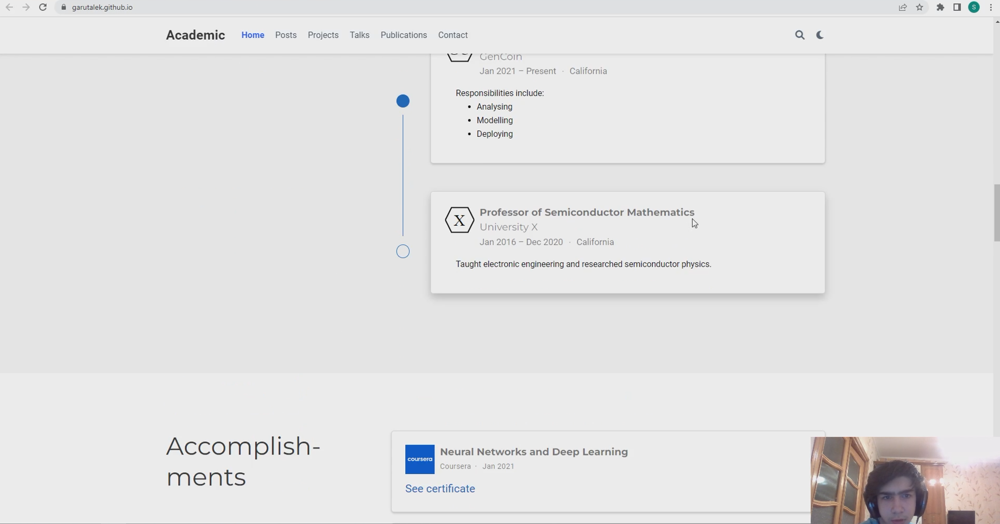

---
## Front matter
title: "Индивидуальный проект"
subtitle: "Этап 1"
author: "Гарут Александр Игоревич"

## Generic otions
lang: ru-RU
toc-title: "Содержание"

## Bibliography
bibliography: bib/cite.bib
csl: pandoc/csl/gost-r-7-0-5-2008-numeric.csl

## Pdf output format
toc: true # Table of contents
toc-depth: 2
fontsize: 12pt
linestretch: 1.5
papersize: a4
documentclass: scrreprt
## I18n polyglossia
polyglossia-lang:
  name: russian
  options:
	- spelling=modern
	- babelshorthands=true
polyglossia-otherlangs:
  name: english
## I18n babel
babel-lang: russian
babel-otherlangs: english
## Fonts
mainfont: PT Serif
romanfont: PT Serif
sansfont: PT Sans
monofont: PT Mono
mainfontoptions: Ligatures=TeX
romanfontoptions: Ligatures=TeX
sansfontoptions: Ligatures=TeX,Scale=MatchLowercase
monofontoptions: Scale=MatchLowercase,Scale=0.9
## Biblatex
biblatex: true
biblio-style: "gost-numeric"
biblatexoptions:
  - parentracker=true
  - backend=biber
  - hyperref=auto
  - language=auto
  - autolang=other*
  - citestyle=gost-numeric
## Pandoc-crossref LaTeX customization
figureTitle: "Рис."
tableTitle: "Таблица"
listingTitle: "Листинг"
lofTitle: "Список иллюстраций"
lotTitle: "Список таблиц"
lolTitle: "Листинги"
## Misc options
indent: true
header-includes:
  - \usepackage{indentfirst}
  - \usepackage{float} # keep figures where there are in the text
  - \floatplacement{figure}{H} # keep figures where there are in the text
---

# Цель работы

Разместить заготовку сайта на github pages.

# Ход работы

1. Подготовка репозитория github

{ #fig:001 width=100% }
*Изображение1.1: Создание временного репоизитория my-wowchemy*

{ #fig:001 width=100% }
*Изображение1.2: Создание репозитория github pages (garutalek.github.io)*

2. Сборка html файла сайта

{ #fig:001 width=100% }
*Изображение2.1: Клонирование временного репозитория*

{ #fig:001 width=100% }
*Изображение2: Сборка html файла*

3. Загрузка сайта на github pages

Копируем получившиеся файлы в my-wowchemy/public и переносим их в клон garutalek.github.io, затем загружаем обновление на github.

{ #fig:001 width=100% }
*Изображение3: Загрузка изменений на github*

4. Проверка работоспособности

Ждём примерно 3 минуты, когда гитхаб всё загрузит, затем проверяем сайт

{ #fig:001 width=100% }
*Изображение4.1: Замечаем что сайт работает*

Меняем данные на сайте чтобы удостовериться в том что мы можем его изменять (я поменял данные о том что я не профессор физики, а профессор математики), нужно также подождать несколько минут.

{ #fig:001 width=100% }
*Изображение4.2: Замечаем что данные на сайте обновились*

# Вывод

Заготовка сайта была размещена на guthub pages, она полностью функционирует, мы также можем вносить изменения на сайт, и они будут отображаться.
